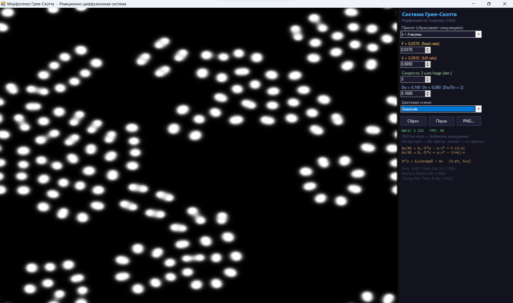

# GrayScott Ultimate Edition

**A high-performance Gray–Scott reaction–diffusion simulator written in C# and Windows Forms.**

Interactive visualization • Real-time simulation • Custom presets • Multiple color maps • Fullscreen mode

 

  

---

## Features

- ⚡ Real-time Gray–Scott reaction–diffusion simulation
- 🎨 Multiple color palettes
- 🧪 Adjustable feed (`F`) and kill (`K`) parameters
- 🖱 Interactive mouse painting
- 📦 Built-in simulation presets
- 🖥 Fullscreen mode
- 🚀 Optimized rendering engine

---

## Screenshots

    

---

## Architecture

    

